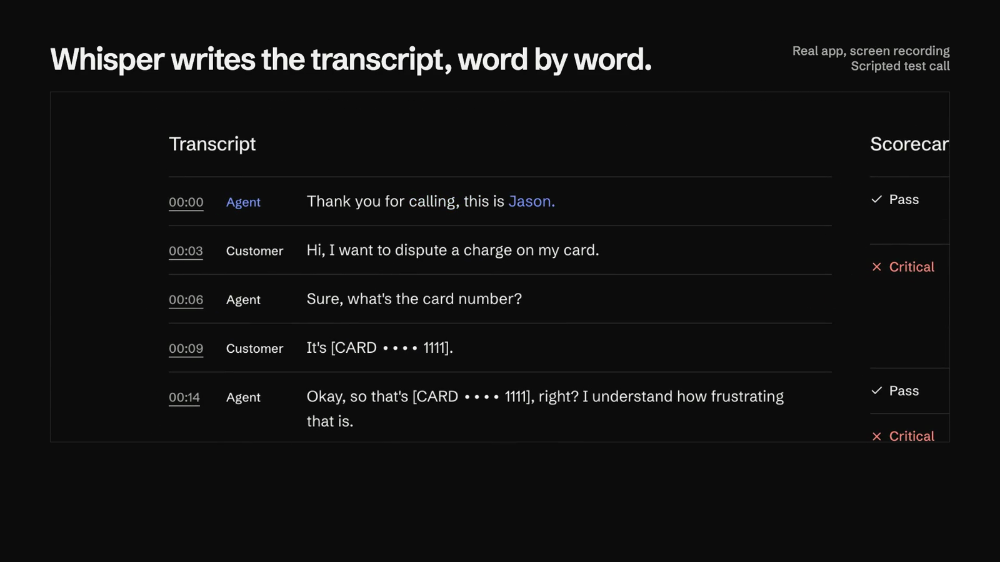
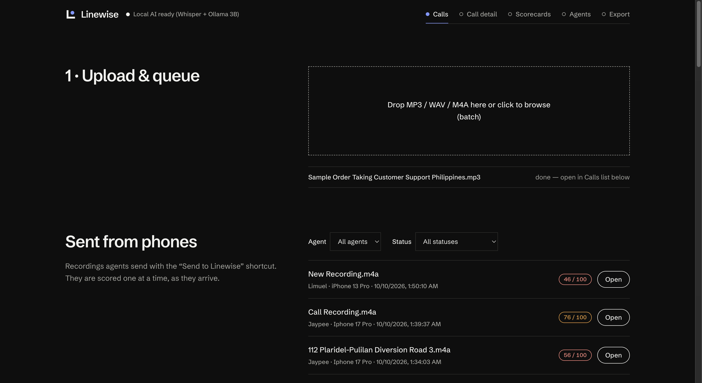
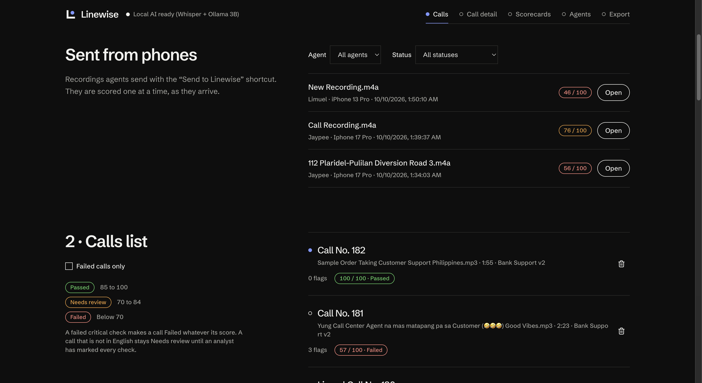
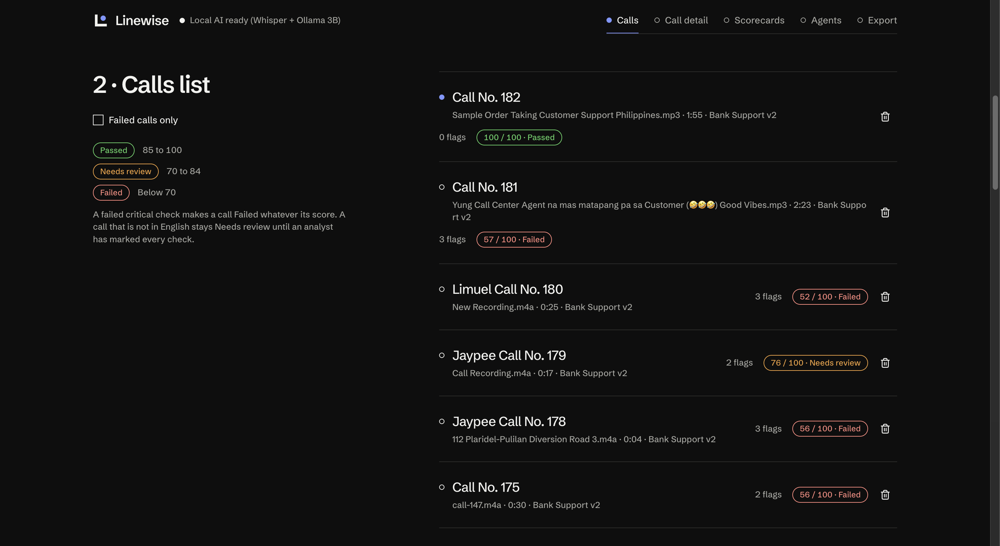
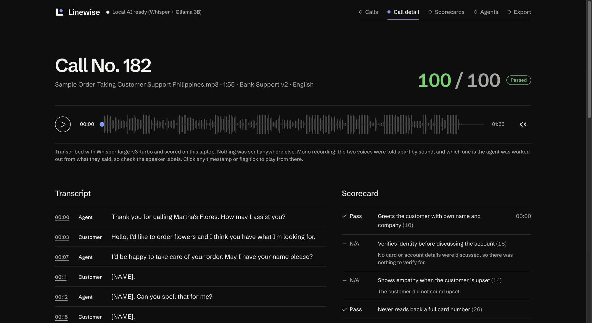
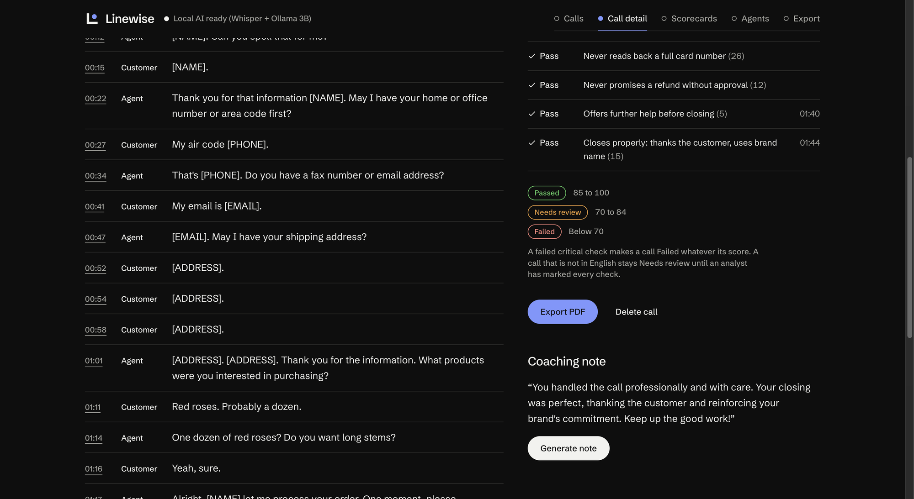
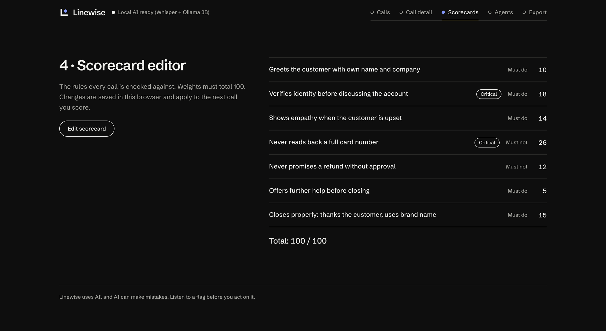
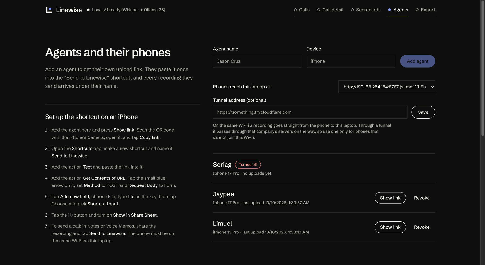
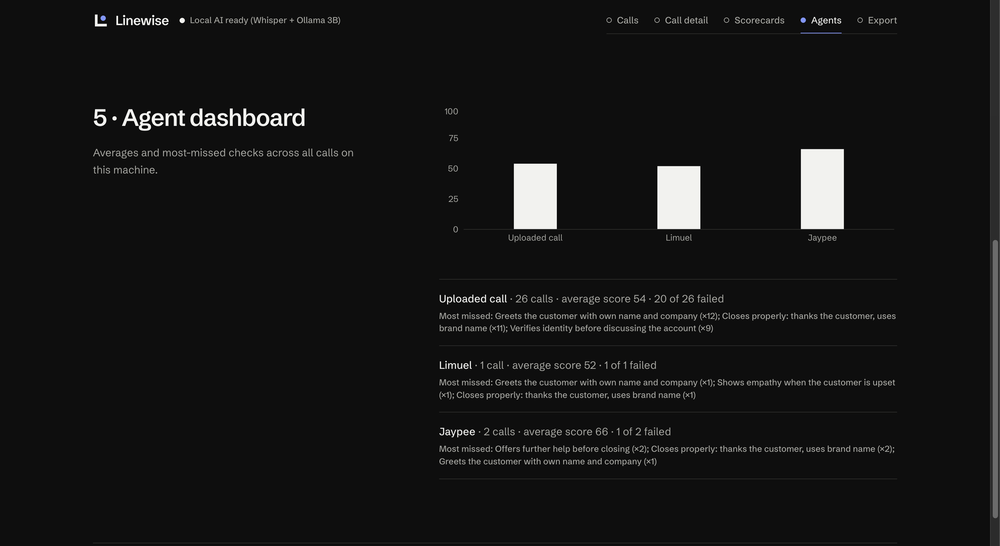
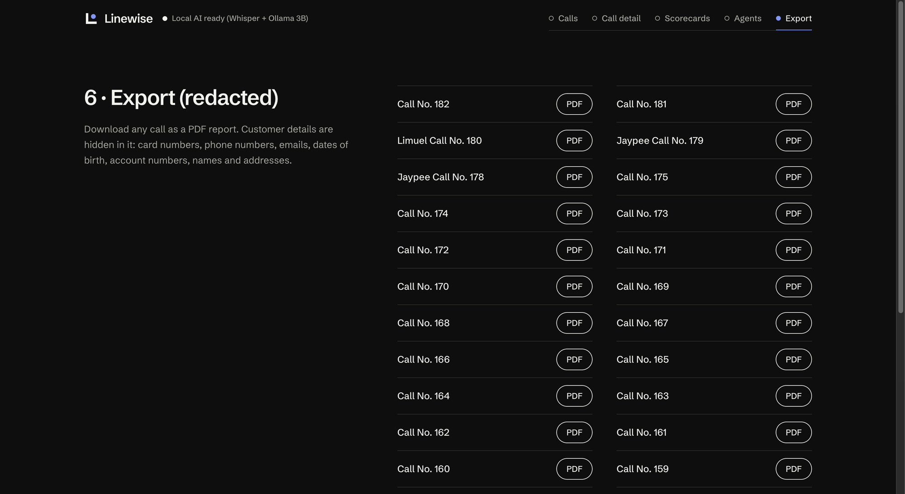

# Linewise

Local-AI quality checks for call center calls. Formerly QA Sentinel.

AppBuildersPH Hackathon 2026, Local AI track. Team Busseng.

| | |
|---|---|
| Demo video | [Watch the 1-minute demo](docs/linewise-demo.mp4) |
| LinkedIn post | https://lnkd.in/p/gXKWvggd |
| GitHub repository | https://github.com/Polstuds27/Linewise |

## Demo

[](docs/linewise-demo.mp4)

**Click the picture to watch the 1-minute demo.** The middle of the video is a screen
recording of the real app scoring a scripted test call, first online and then with all
internet access blocked.

## Problem

In call centers, every call is supposed to be checked: did the agent verify the
customer's identity, follow the script, say the required disclosures, and actually solve
the problem? QA analysts do this by listening to recordings one by one and filling in a
scorecard. That is slow, so only a small sample of calls ever gets reviewed and coaching
comes days late.

## Brief description

Linewise automates that check. Upload a recording and it transcribes the call, redacts
customer PII, scores it against the QA rubric, and flags the exact moments that need
coaching, all on the analyst's own device.

For every call it:

1. writes the transcript, with each line tagged Agent or Customer and timed to the audio;
2. hides card numbers, emails, phone numbers, account IDs, names and addresses;
3. checks the call against a scorecard, one rule at a time, and gives each rule a Pass,
   Fail or N/A with the quoted line as evidence;
4. scores the call out of 100 and marks it Passed (85 to 100), Needs review (70 to 84) or
   Failed (below 70, or any critical rule broken);
5. lets the analyst click a flag to hear that exact moment, confirm or dismiss it, and
   export a redacted PDF report.

It also has a scorecard editor, a per-agent dashboard, coaching notes, and a way for
agents to send recordings from their phones over the office Wi-Fi.

It analyzes recordings only. It does not listen to live calls.

## Why does this product benefit from running AI locally?

Call QA is a daily job across the Philippine IT-BPM industry. Its industry association,
IBPAP, started 2026 with an outlook of about $42 billion in export revenue and close to
2 million jobs for the year
([SunStar](https://www.sunstar.com.ph/cebu/it-bpm-eyes-42b-exports-near-2-million-jobs-in-2026)).
Scoring protects the business: it catches compliance misses, keeps client contracts safe,
and tells team leads who needs coaching.

But call recordings are full of sensitive customer data such as names, addresses and
account numbers. Sending that audio to a third-party cloud AI creates privacy risk under
the Data Privacy Act and can break client data rules.

- **Privacy.** Linewise runs transcription, redaction and scoring on the device, so the
  audio never leaves the machine.
- **No per-minute cost.** There is no API bill, so a team can afford to score every call
  instead of a sample.
- **Works offline.** Once the models are downloaded, it keeps working when the internet
  drops. The app makes no request to any other machine.

### What runs locally

Everything: speech-to-text, speaker separation, redaction, scoring, coaching notes,
storage, the PDF export and the interface.

### What requires internet

Setup only: `npm install`, `npm run models` (speech models, about 340 MB),
`ollama pull qwen2.5:3b` (about 2 GB) and, on macOS, the first `npm run whisper`
(1.6 GB). Running the app needs none.

One optional feature uses the internet when it is turned on: a Cloudflare Tunnel that
lets a phone outside the office Wi-Fi send recordings to the laptop. It is off by
default. See "APIs and cloud services" below.

## Screenshots

The screens in the order an analyst uses them. The calls shown are recordings we ran through the app while testing, including ones sent from our own phones; those audio files are not in the repo.



**1. Upload and queue.** Drop recordings into the Calls tab and each one is transcribed and scored in turn. Recordings sent from agents' phones appear underneath.



**2. Sent from phones.** Each recording an agent sends from an iPhone is listed with who sent it, when, and the score it got. Filter by agent or status.



**3. Calls list.** Every scored call with its number of flags, score and status, beside the legend: Passed 85 to 100, Needs review 70 to 84, Failed below 70.



**4. Call detail.** The score and status, a waveform player, the transcript split into Agent and Customer, and a verdict for every rule with its reason. The note under the player says which model transcribed the call.



**5. Redaction and coaching note.** Names, phone numbers, emails and addresses are hidden in the transcript. Below the scorecard: the score ranges, the PDF export and a coaching note written by the local model.



**6. Scorecard editor.** The rules every call is checked against, each with a weight, a must-do or must-not type and an optional Critical mark. Weights must total 100.



**7. Agents and their phones.** Add an agent to get their own upload link, with steps for setting up the iPhone shortcut. The page says plainly that a tunnel sends audio through another company's servers.



**8. Agent dashboard.** Average score per agent, how many of their calls failed, and the rules they miss most.



**9. Export.** Download any call as a PDF report with customer details hidden.

## Technical disclosures

What was used to build and run Linewise. What runs locally and what needs internet are
covered above, under "Why does this product benefit from running AI locally?".

### AI models

All four run on the user's own machine. There is no cloud inference.

| Model | What it does | Where it runs |
|---|---|---|
| qwen2.5:3b | Answers yes/no questions about the transcript for scoring, finds names and addresses to hide, writes coaching notes | Ollama on `localhost:11434` |
| Whisper large-v3-turbo | Speech-to-text, used when `npm run whisper` is running (macOS) | whisper.cpp on `localhost:8178` |
| Whisper base (`Xenova/whisper-base`, ONNX) | Speech-to-text when the native one is not running | In the browser, in a Web Worker, through Transformers.js |
| pyannote segmentation 3.0 (`onnx-community/pyannote-segmentation-3.0`, ONNX) | Tells the two voices apart on mono recordings | In the browser |

The scoring model never gives a verdict directly. Each rule is split into yes/no questions
asked over only the lines that can answer them; code turns the answers into the verdict
and the evidence line, and rejects a quote that is not in the transcript.

### Frameworks and libraries

| Part | Used |
|---|---|
| App (`client/`) | React 19, Vite 8, TypeScript, Tailwind CSS v4, Transformers.js with ONNX Runtime Web, Dexie (IndexedDB), Recharts, jsPDF, qrcode |
| Interface components | shadcn/ui (shadcn CLI and component source) on Base UI, Lucide icons, class-variance-authority, tw-animate-css, cn |
| Server (`server/`, optional) | Node.js, Express, Multer, SQLite through Node's built-in `node:sqlite` |
| Local runtimes | Ollama, whisper.cpp |
| Testing | puppeteer-core, oxlint |
| Demo video (`linewise-ads/`) | Remotion |

### APIs and cloud services

None are needed. The app talks only to `localhost`: Ollama on 11434, whisper.cpp on 8178
and its own server on 8787. Phone uploads use an Apple Shortcut that posts to the laptop
over the same Wi-Fi.

One optional cloud service: **Cloudflare Tunnel** (`cloudflared`, a free quick tunnel), for
agents whose phones cannot join the laptop's Wi-Fi. It is off unless the QA lead starts
it and saves its address on the Agents tab.

- With the tunnel on, a recording travels from the phone through Cloudflare's servers to
  the laptop. The app says so on that screen. Transcription and scoring still run only on
  the laptop; no AI runs in the cloud.
- Only the upload route is reachable through the tunnel. Stored calls, the agent list and
  settings answer only to the laptop itself. Checked on Oct 10, 2026: through the tunnel
  those routes returned "Only available on the Linewise laptop itself".
- To start it: `brew install cloudflared`, then
  `cloudflared tunnel --url http://localhost:8787`. Steps are in `docs/PHONE_UPLOADS.md`.

### AI development tools

- Claude Code (Opus 5.5): writing and reviewing code and docs, and building the demo video project.
- Open Code 2.0.23 (Muse 1.3): code scaffolding and the backend.

### Existing code and assets

- **Code:** none existed before the hackathon; the first commit is from Oct 9, 2026.
  Starting points were the Vite React TypeScript template, shadcn/ui component source and
  the Remotion blank template.
- **Logo and favicon:** made for this project.
- **Font:** Schibsted Grotesk (SIL Open Font License), self-hosted.
- **Test recordings in the repo:** the calls in `client/samples/` are scripted and spoken
  by text-to-speech voices, generated by `client/scripts/make_sample_calls.py`. The card
  number in them is the standard test number 4111 1111 1111 1111. The app does not ship
  with them loaded.
- **Other test recordings:** we also tested with sample call recordings and short
  recordings from our own phones. None of those are in the repo.
- **Demo video:** the app footage is a screen recording of the real app; the music and
  sound effects are synthesized by `linewise-ads/scripts/make-audio.mjs`. No stock media.

## Run it

Needs Node.js 20 or newer (22.13 or newer for the optional server) and
[Ollama](https://ollama.com).

```sh
ollama pull qwen2.5:3b
ollama serve

cd client
npm install
npm run models   # once: downloads the speech models
npm run dev      # then open http://localhost:5173
```

If the header says "Ollama is not running" while it is, start Ollama with the app's
address allowed: `OLLAMA_ORIGINS=http://localhost:5173 ollama serve`. On Windows,
`setup-local.ps1` installs and configures everything.

Then try it: on the Calls tab, upload `client/samples/call-147.m4a` and press
**Transcribe & score**. The agent in that call reads a card number back and never checks
the caller's identity, so it should come out as 62 / 100, Failed, with two critical flags.

Optional:

```sh
npm run whisper  # macOS: Whisper large-v3-turbo through whisper.cpp (brew install whisper-cpp)
npm --prefix ../server install && npm run server  # SQLite storage and uploads from phones
```

Without the server, calls are stored in the browser (IndexedDB).

## Tested hardware

| Machine | Specification | What was run on it |
|---|---|---|
| MacBook Pro (Mac16,8) | Apple M4 Pro, 12 CPU cores (8 performance, 4 efficiency), 16 GPU cores, 24 GB memory, macOS 26.3 | Everything: both speech engines, scoring, the server, phone uploads, the offline run and the benchmark below. This is the demo machine. |
| Windows laptop | Intel Core i5-8250U, 16 GB memory, Intel UHD 620 with NVIDIA MX150 (2 GB), Windows 10 Pro | The app with Whisper base in the browser and Ollama on the CPU, on Oct 9 with an earlier build. It works there but is much slower: about 40 s to transcribe a 67 s recording and 20 to 30 s per rule to score. Not re-measured on the current build. |
| iPhone 17 Pro, iPhone 13 Pro | iOS, on the same Wi-Fi as the laptop | Sending recordings to the laptop with the "Send to Linewise" shortcut. |

Software on the Mac when measured: Chrome 154, Node.js 24.13, Ollama 0.40.2 with
qwen2.5:3b (1.9 GB), whisper.cpp 1.9.5 with Whisper large-v3-turbo.

## Benchmark

Measured on the MacBook Pro above on Oct 10, 2026, with `npm run benchmark`
(`client/scripts/benchmark.mjs`). The script drives the real app in Chrome and times each
call from pressing **Transcribe & score** to the scored call appearing.

Seconds, median of 3 runs (lowest to highest):

| Recording | Length | Speech engine | Transcribe and split speakers | Redaction | Scoring (7 rules) | Total | Result |
|---|---|---|---|---|---|---|---|
| call-147.m4a | 0:30 | Whisper large-v3-turbo (whisper.cpp) | 2.7 (2.7 to 2.9) | 0.1 (0.1 to 0.3) | 3.9 (3.8 to 4.5) | 6.9 (6.6 to 7.6) | 62 / 100, Failed |
| call-148.m4a | 0:17 | Whisper large-v3-turbo (whisper.cpp) | 2.5 (2.4 to 2.5) | 0.1 (0.1 to 0.3) | 5.0 (5.0 to 5.1) | 7.7 (7.5 to 7.8) | 100 / 100, Passed |
| call-149.m4a | 0:07 | Whisper large-v3-turbo (whisper.cpp) | 2.5 (2.4 to 2.5) | 0.1 (0.1 to 0.2) | 5.7 (5.4 to 5.7) | 8.3 (8.1 to 8.4) | 39 / 100, Failed |
| call-147.m4a | 0:30 | Whisper base (in browser) | 9.8 (9.7 to 10.2) | 0.1 (0.1 to 0.3) | 3.8 (3.8 to 4.2) | 13.7 (13.6 to 14.7) | 62 / 100, Failed |
| call-148.m4a | 0:17 | Whisper base (in browser) | 4.9 (4.8 to 5.0) | 0.6 (0.6 to 0.7) | 3.7 (3.6 to 3.9) | 9.2 (9.0 to 9.4) | 100 / 100, Passed |
| call-149.m4a | 0:07 | Whisper base (in browser) | 4.5 (4.4 to 4.5) | 0.1 (0.1 to 0.2) | 3.7 (3.7 to 4.3) | 8.4 (8.2 to 8.8) | 39 / 100, Failed |

How to read it:

- These are timings of our three scripted test recordings on one machine. They show how
  fast the app ran here; they do not measure accuracy.
- The first call after starting loads the models and is not counted. It took 5.6 s with
  native Whisper and 11.0 s with Whisper in the browser.
- Each call gave the same score and status on every run and with both speech engines.
- Scoring times moved by a second or two between whole runs of the script.
- Everything ran on the laptop. Storage was the in-browser fallback, not the server.

Regression checks, run the same day on the same machine:

| Check | What it covers | Result |
|---|---|---|
| `npm run eval` | 18 scripted transcripts, 7 rules each, with the verdict we expect | 126 of 126 verdicts as expected, in 72 s |
| `npm run eval:redaction` | 9 scripted calls with details that must be hidden and details that must stay | 33 of 33 hidden, 24 of 24 kept, in 5 s |

The scoring prompt was developed against these transcripts, so a full pass means nothing
has regressed. It is not an accuracy rate for real calls, and we do not claim one.

## Limits

- Scoring is tuned for English. A call in another language is still transcribed, but it
  is left unscored and marked Needs review until an analyst marks each rule by hand.
- We do not claim an accuracy rate. The test recordings are scripted with synthetic
  voices, and the Benchmark section reports timings and regression checks on them, not
  accuracy on real calls.
- Rules you write yourself in the scorecard editor are judged with one general question
  each, which is cruder than the seven built-in rules.
- Phone uploads stay on your own network only on the same Wi-Fi or a hotspot. With the
  optional Cloudflare Tunnel on, the audio passes through Cloudflare's servers on the way
  to the laptop.
- The native Whisper path is macOS only. Elsewhere the smaller Whisper base runs in the
  browser and makes more transcription mistakes.

## Repository

- `client/`: the app. Developer notes are in `client/README.md`; the design system is in
  `client/DESIGN.md`.
- `server/`: optional storage and phone-upload server.
- `docs/`: build notes, and the phone upload guide (`docs/PHONE_UPLOADS.md`).
- `linewise-ads/`: the demo video project.

## Team

Team Busseng: John Patrick Soriaga, Paul Adrianne Mojal, James Ian Antonio and Limuel Camangon.
